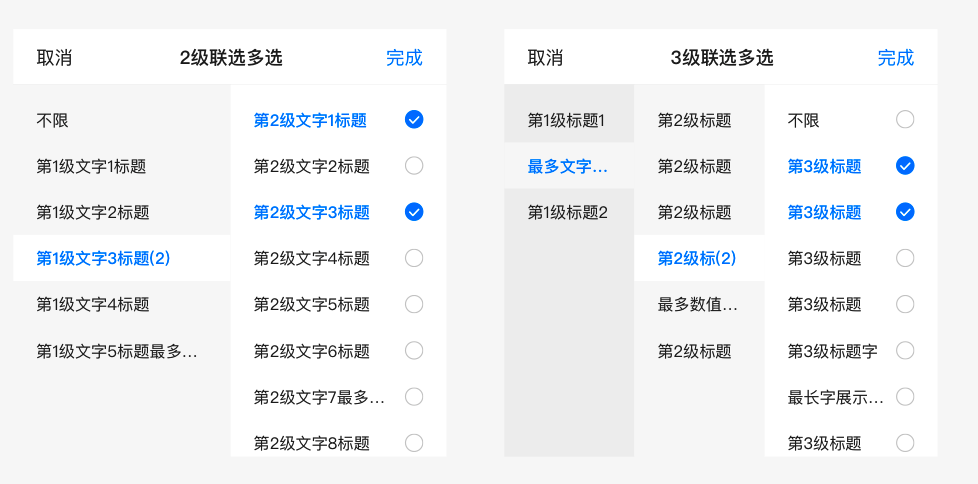

# BrnMultiColumnPicker

用于页面底部的级联选择器

## 一、效果总览



## 二、描述

### 适用场景

适用于底部弹出 Picker 进行级联选择数据的情况。

### 注意事项

1. 所有节点 BrnPickerEntity 的 type 字段必须有具体类型，不可为空；目前支持类型有 radio、checkbox。
2. 如果需要异步请求筛选数据或组装筛选数据 Entity，刷新筛选组件数据，需要在根结点 entity 中做 configChild() 操作。
3. 数据结构中的 key 字段必须设置，如果结点中没有 key ，则该结点虽然可以选中，但是其子结点的数据不会返回。
4. 最顶层的筛选节点 type 需要有类型（单选 radio、多选 checkbox），不能为空。

## 三、构造函数及参数配置

### 构造函数

```dart
BrnMultiColumnPicker(
  {Key key,
  @required this.entity,
  this.maxHeight = 280.0,
  this.showSelectedCount = false,
  this.isIncludeUnLimit = false,
  this.onConfirm,
  this.onEntityTap,
  this.canSelectEntryInterceptor,
  this.defaultFocusedIndexes,
  this.pickerTitleConfig = BrnPickerTitleConfig.Default,
  this.themeData})
```

### 参数配置

| 参数名                    | 参数类型                                                     | 作用                                                         | 是否必填 | 默认值                       |
| ------------------------- | ------------------------------------------------------------ | ------------------------------------------------------------ | -------- | ---------------------------- |
| entity                    | BrnPickerEntity                                              | 筛选数据源                                                   | 是       |                              |
| maxHeight                 | double                                                       | Picker 展示最大高度                                          | 否       | 280.0                        |
| showSelectedCount         | bool                                                         | 展示选中的条目的个数                                         | 否       | false                        |
| onConfirm                 | BrnOnPickerConfirm                                           | 选择数据后回调函数                                           | 否       | null                         |
| onEntityTap               | BrnOnEntityTap                                               | 选择项目后回调函数                                           | 否       | null                         |
| pickerTitleConfig         | BrnPickerTitleConfig                                         | Picker 标题数据配置                                          | 否       | BrnPickerTitleConfig.Default |
| isIncludeUnLimit          | bool                                                         | 当选中”不限“的时候，返回的 reslut 结果是否包含 “不限” 选项，“不限” 选项 value 字段不能为空，上一级 key 字段不能为空 | 否       | false                        |
| canSelectEntryInterceptor | bool BrnOnSelectEntityInterceptor( int listIndex, int index, BrnPickerEntity entity) | 当前选项是否可以被选中:返回 true 可以被选中 false 不可以被选中 | 否       |                              |
| defaultFocusedIndexes     | `List<int>`                                                  | 初始化时的选中选项                                           | 否       |                              |

### 其它数据结构

#### 筛选类型

```dart
enum PickerFilterType {
  None, //未设置
  Radio, //单选项，对应 type 为 radio
  Checkbox, //多选项，对应 type 为 checkbox
}
```

#### 选择 Entity

```dart
class BrnPickerEntity {
  String uniqueId; //唯一的id，可选
  String name; //筛选显示的文案
  String key; //回传给服务器的 key
  String value; //回传给服务器的 value
  String type; //类型 是单选、复选还是有自定义输入
  List<BrnSelectionEntity> children; //下级筛选项
  String defaultValue; //默认选中下一级的值，若 defaultValue 与 children 字段中筛选项的 value 值相同，则在数据初始化时将 isSelected 置为 true。
  Map extMap; //扩展字段，目前只有min和max，最大值，最小值范围；unit单位，例如居室、万，适配自定义区间填写的内容
  /// 支持最大选中个数,用于限制子节点可选中的最大个数。默认为 65535
  int maxSelectedCount;
}
```

## 四、效果及代码展示

### 效果1：

[示例数据 list_picker.json](../../../example/assets/list_picker.json)


```dart
/// 加载 Picker 数据
rootBundle.loadString('assets/list_picker.json').then((data) {
  List<BrnPickerEntity> _selectionData = List()
    ..addAll((JsonDecoder().convert(data)["data"]['list'] as List ?? [])
        .map((o) => BrnPickerEntity.fromMap(o)));
  if (_selectionData != null && _selectionData.length > 0) {
    _selectionData?.forEach((f) => f.configRelationshipAndDefaultValue());
    if (dataList.length == 0) {
      dataList.addAll(_selectionData);
    }
    _showRangePicker(context, dataList);
  }
});

/// 弹出 Picker
void _showRangePicker(BuildContext context, List<BrnPickerEntity> _selectionData) {
  _selectionData?.forEach((f) => f.configRelationshipAndDefaultValue());
  var selectionMenuView = BrnMultiColumnPicker(
    entity: _selectionData[3],
    defaultFocusedIndexes: [0, -1, -1],
    onConfirm: (Map<String, List<BrnPickerEntity>> result, int firstIndex,
        int secondIndex, int thirdIndex) {
      List<String> pickResult = List();
      result.forEach((key, val) {
        List<String> tmp = List();
        val.forEach((item) {
          tmp.add(item.name);
        });
        pickResult.add(tmp.toString());
      });
      BrnToast.show(pickResult.toString(), context);
    },
    onEntityTap: (int columnIndex, int rowIndex, BrnPickerEntity entity) {
      BrnToast.show('$columnIndex + $rowIndex + ${entity.name}', context);
    },
  );
  showModalBottomSheet(
    context: context,
    backgroundColor: Colors.transparent,
    builder: (BuildContext dialogContext) {
      return selectionMenuView;
    },
  );
}
```
